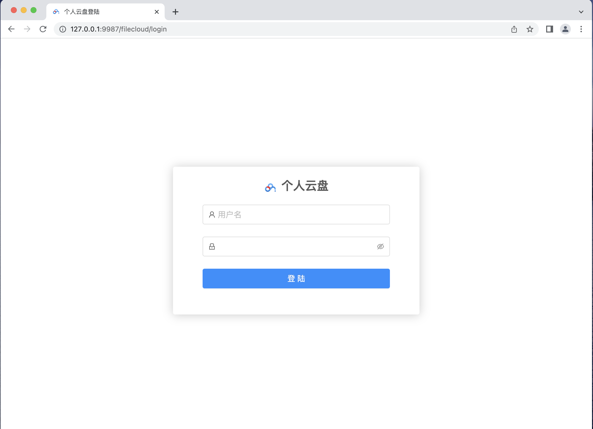
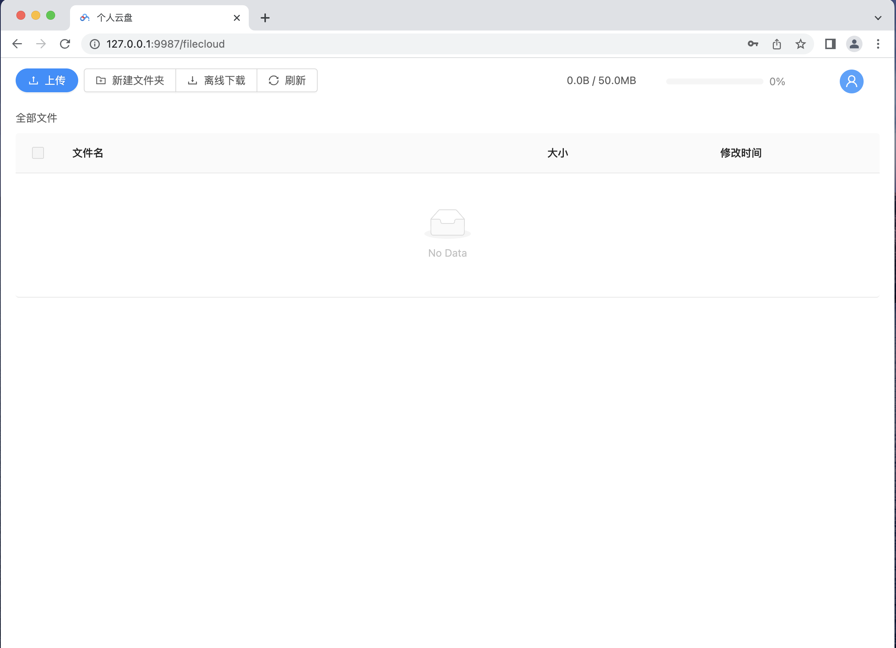
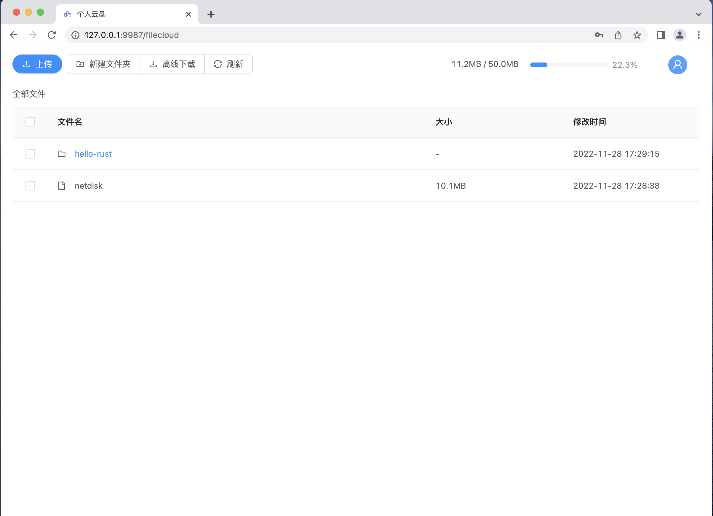

# 个人网盘项目

## 简介
一个简单的个人网盘web项目，包括前端和后端的完整项目。

使用到的技术：
后端：go + gin
前端：vue2 + antd ui库

## 功能支持

+ 账号登陆、验证
+ 文件上传，支持单文件、多文件、文件夹的上传
+ 文件秒传
+ 网盘内的文件、文件夹拷贝、移动
+ 文件下载
+ 分享链接

## 页面展示

+ 登陆页面



+ 文件管理页面



+ 文件上传后页面



## 功能原理

### 分片上传、断点续传

文件过大时，上传文件需要很久，而且中途退出将导致文件重传。
使用分片上传技术，在上传文件时，在本地将文件按照4M的大小将文件进行分片。在服务端将文件组合。
使用断点续传技术，如果文件没有上传完，客户端意外关闭，再一次上传文件时，对比服务器已经上传的分片，
只需要上传没有的分片即可。
分片上传和断点续传时网盘的必备技术和设计思想。

### 秒传
每一个文件都有对应的md5码。当检测上传文件时，如果本地已经存在相同的md5的文件，则不需要用户上传。

### 文件保存方案
在配置文件中有`SaveFileMultiple`选项，选择是否保存多份文件到远端。

+ 当 SaveFileMultiple=false，仅添加文件指向，当前文件夹下不存在该文件， 即整个云盘只存在一份源文件。 
  删除时，判读文件引用，当引用为0时执行文件的删除;若删除源文件且还有文件引用，将文件移动到引用处。
  
+ 当 SaveFileMultiple=true，会将源文件拷贝一份到当前目录。整个云盘存在多份文件，
  磁盘占用为N倍。删除时，直接删除当前文件。

## 启动项目

### 前端项目
```bash
  npm i 
  npm run build
```
生成dist文件夹

### 后端项目

```bash
  go mod tidy
  go build
```

配置`config.json`

```json
{
    "WebAddr":"127.0.0.1:9987",
    "WebIndex":"../dist",
    "FilePath":"cloud",
    "StaticFS":true,
    "FileDiskTotal":50,
    "Username":"alex",
    "Password":"123456"
}
```
运行可执行文件`./netdisk`，浏览器访问`http://127.0.0.1:9987`

